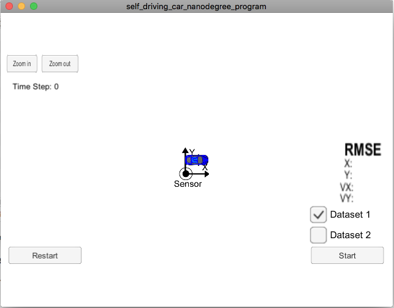
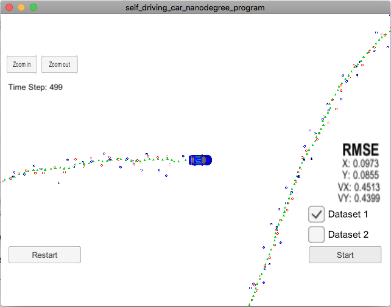
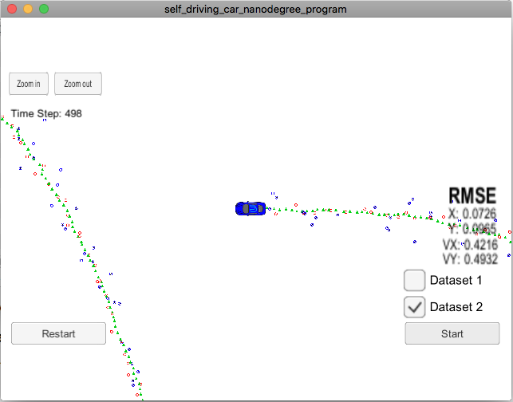

# Extended Kalman Filter Project
Self-Driving Car Engineer Nanodegree Program

In this project a kalman filter is utilized  to estimate the state of a moving object of interest with noisy lidar and radar measurements. Obtained RMSE values are lower than the tolerance outlined in the project rubric.

This project involves the Term 2 Simulator which can be downloaded [here](https://github.com/udacity/self-driving-car-sim/releases)

This repository includes two files that can be used to set up and install [uWebSocketIO](https://github.com/uWebSockets/uWebSockets) for either Linux or Mac systems. For windows you can use either Docker, VMware, or even [Windows 10 Bash on Ubuntu](https://www.howtogeek.com/249966/how-to-install-and-use-the-linux-bash-shell-on-windows-10/) to install uWebSocketIO. Please see [this concept in the classroom](https://classroom.udacity.com/nanodegrees/nd013/parts/40f38239-66b6-46ec-ae68-03afd8a601c8/modules/0949fca6-b379-42af-a919-ee50aa304e6a/lessons/f758c44c-5e40-4e01-93b5-1a82aa4e044f/concepts/16cf4a78-4fc7-49e1-8621-3450ca938b77) for the required version and installation scripts.

Once the install for uWebSocketIO is complete, the main program can be built and run by doing the following from the project top directory.

1. mkdir build
2. cd build
3. cmake ..
4. make
5. ./ExtendedKF

Tips for setting up your environment can be found [here](https://classroom.udacity.com/nanodegrees/nd013/parts/40f38239-66b6-46ec-ae68-03afd8a601c8/modules/0949fca6-b379-42af-a919-ee50aa304e6a/lessons/f758c44c-5e40-4e01-93b5-1a82aa4e044f/concepts/23d376c7-0195-4276-bdf0-e02f1f3c665d)

Programs that are written to accomplish the project are src/FusionEKF.cpp, src/FusionEKF.h, kalman_filter.cpp, kalman_filter.h, tools.cpp, and tools.h

The program main.cpp has already been filled out.

Here is the main protcol that main.cpp uses for uWebSocketIO in communicating with the simulator.


INPUT: values provided by the simulator to the c++ program

["sensor_measurement"] => the measurement that the simulator observed (either lidar or radar)


OUTPUT: values provided by the c++ program to the simulator

["estimate_x"] <= kalman filter estimated position x
["estimate_y"] <= kalman filter estimated position y
["rmse_x"]
["rmse_y"]
["rmse_vx"]
["rmse_vy"]

---

## Other Important Dependencies

* cmake >= 3.5
  * All OSes: [click here for installation instructions](https://cmake.org/install/)
* make >= 4.1 (Linux, Mac), 3.81 (Windows)
  * Linux: make is installed by default on most Linux distros
  * Mac: [install Xcode command line tools to get make](https://developer.apple.com/xcode/features/)
  * Windows: [Click here for installation instructions](http://gnuwin32.sourceforge.net/packages/make.htm)
* gcc/g++ >= 5.4
  * Linux: gcc / g++ is installed by default on most Linux distros
  * Mac: same deal as make - [install Xcode command line tools](https://developer.apple.com/xcode/features/)
  * Windows: recommend using [MinGW](http://www.mingw.org/)

## Basic Build Instructions

1. Clone this repo.
2. Make a build directory: `mkdir build && cd build`
3. Compile: `cmake .. && make` 
   * On windows, you may need to run: `cmake .. -G "Unix Makefiles" && make`

## Running the Filter

In your build directory run it: `./ExtendedKF `. The output should be:

```
Listening to port 4567
```
You need to start the Term 2 simulator. If the simulator is running, the filter should be able to connect to it and the output should be:

```
Listening to port 4567
Connected!!!
```
Here is the simulator window when just started:



The simulator provides two datasets. The difference between them are:

- The direction the car is moving.
- The order the first measurement is sent to the EKF. On dataset 1, the LIDAR measurement is sent first. On the dataset 2, the RADAR measurement is sent first.

Here is the result after running the EKF with the Dataset 1:



And here is the result after running the EKF with the Dataset 2:



# [Rubric](https://review.udacity.com/#!/rubrics/748/view) points

## Compiling

### Your code should compile

The code compiles without errors with `cmake` and `make` but only has been tested on Mac OS.

## Accuracy

### px, py, vx, vy output coordinates must have an RMSE <= [.11, .11, 0.52, 0.52] when using the file: "obj_pose-laser-radar-synthetic-input.txt which is the same data file the simulator uses for Dataset 1"

The EKF accuracy was:

- Dataset 1 : RMSE <= [0.0973, 0.0855, 0.4513, 0.4399]
- Dataset 2 : RMSE <= [0.0726, 0.0965, 0.4216, 0.4932]

## Follows the Correct Algorithm

### Your Sensor Fusion algorithm follows the general processing flow as taught in the preceding lessons

The actual Kalman Filter implementation can be found in [src/kalman_filter.cpp](./src/kalman_filter.cpp) and it is used to predict at [src/FusionEKF.cpp](./src/FusionEKF.cpp#L167) line 167 and to update at lines 184 and 190 depending on the sensor type used. The output is printed at lines 194 to 195.

### Your Kalman Filter algorithm handles the first measurements appropriately

The first measurement is handled at [src/FusionEKF.cpp](./src/FusionEKF.cpp#L87) from line 87 to line 125. The first measurements are used to initialize the state vectors and covariance matrices respecting sensor types.

### Your Kalman Filter algorithm first predicts then updates

Upon receiving a measurement after the first, the algorithm predicts object position to the current timestep  at [src/FusionEKF.cpp](./src/FusionEKF.cpp#L167) line 167 and then updates the prediction using the new measurement at lines 184 and 190.

### Your Kalman Filter can handle radar and lidar measurements

Different type of measurements are handled in two places in [src/FusionEKF.cpp](./src/FusionEKF.cpp):

- For the first measurement in lines 87 through 125.
- For the update part in lines 179 through 191.

## Code Efficiency

### Your algorithm should avoid unnecessary calculations

One of the examples of previous computation results reuse can be found in lines 152 through 154 in [src/FusionEKF.cpp](./src/FusionEKF.cpp#L152).
